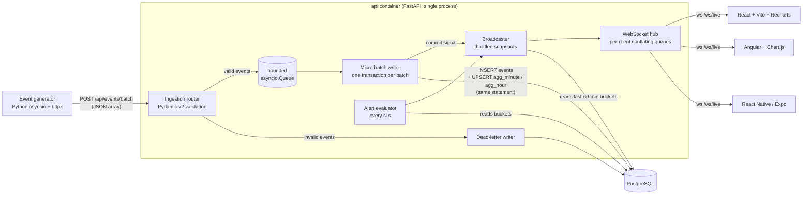

# PLAN — realtime-analytics-dashboard

A real-time analytics pipeline for e-commerce order events (amounts in MAD, Moroccan
cities), with live dashboards in **three client stacks**: React (web), Angular (web) and
React Native (Expo — mobile, plus a web build).

This file is the roadmap. Design rationale lives in [docs/DECISIONS.md](docs/DECISIONS.md).

---

## 1. Architecture



### Data flow in one sentence
The generator posts batches → the API validates each event individually (bad ones go to a
dead-letter table) → valid events wait in a bounded in-memory queue → a single writer task
drains it and, **in one SQL statement**, inserts the raw events and increments minute/hour
aggregate buckets → after commit it wakes the broadcaster, which reads the small aggregate
tables and pushes a snapshot to every WebSocket client (at most every 250 ms).

### Key design choices (details in DECISIONS.md)
| Topic | Choice |
|---|---|
| DB driver | `asyncpg` directly (no ORM): we need `unnest` bulk inserts and data-modifying CTEs |
| Aggregation | Incremental: `INSERT … ON CONFLICT DO UPDATE SET count = count + excluded.count` on time-bucketed tables, driven only by the rows that were *actually inserted* (duplicates never double-count) |
| Dimensions | One `agg_minute` table keyed by `(bucket, dimension, dim_value, event_type)` filled with `GROUPING SETS` (all / category / city / payment_method) |
| Write path | Group commit: requests enqueue events with a future and get `202` only after the batch commits |
| Backpressure | Bounded queue → `429 Too Many Requests` + `Retry-After`; generator backs off |
| Slow WS clients | Per-client "latest snapshot wins" slot (conflation) + small alert queue; send timeout disconnects stuck clients |
| Liveness | App-level `ping` every 15 s; clients reconnect with exponential backoff + jitter if silent for 30 s |
| Contract | WebSocket message types defined once in Pydantic → exported JSON Schema → generated TypeScript shared by all three frontends |

---

## 2. Domain

Event (`POST /api/events` or `/api/events/batch`):

| field | type | notes |
|---|---|---|
| `event_id` | UUID | idempotency key (duplicates ignored) |
| `order_id` | UUID | groups the lifecycle of one order |
| `event_type` | enum | `order_placed`, `order_paid`, `order_shipped`, `order_cancelled` |
| `occurred_at` | datetime (tz-aware) | set by the producer; used for bucketing and latency |
| `amount_mad` | decimal(12,2) | > 0, ≤ 1,000,000 |
| `category` | enum | electronics, fashion, home, beauty, grocery, sports, books, toys |
| `city` | string | Casablanca, Rabat, Marrakech, Fès, Tanger, Agadir, Meknès, Oujda, Kénitra, Tétouan… (validated, 1–64 chars) |
| `payment_method` | enum | card, cash_on_delivery, bank_transfer, wallet |
| `customer_id` | string | 1–64 chars |

Metric definitions (all over a rolling window, default last 60 min):
- **Revenue** = sum of `amount_mad` of `order_paid` events.
- **Orders** = count of `order_placed`.
- **Average order value (AOV)** = revenue / count of `order_paid`.
- **Cancellation rate** = `order_cancelled` / `order_placed` in the same window.
- **Orders per status** = count per `event_type`.
- **Top categories / cities** = ranked by revenue.
- **Pipeline health** = ingested events/s, dead-letter rate, freshness lag.

---

## 3. Folder structure

```
.
├── PLAN.md, README.md, docker-compose.yml, .env.example
├── pyproject.toml / uv.lock        # uv workspace root (dev tools: ruff, mypy, pytest)
├── backend/                        # FastAPI app
│   ├── Dockerfile, pyproject.toml
│   ├── src/analytics_api/
│   │   ├── main.py                 # app factory + lifespan (pool, writer, broadcaster, alerts)
│   │   ├── config.py               # pydantic-settings
│   │   ├── domain/                 # Pydantic event models & enums
│   │   ├── db/                     # asyncpg pool, SQL migrations, migration runner
│   │   ├── ingestion/              # router, micro-batch writer, dead-letter
│   │   ├── processing/             # aggregate upsert SQL, metric snapshot queries
│   │   ├── alerts/                 # pure rule functions + evaluator loop
│   │   └── realtime/               # WS protocol models, hub, broadcaster, router
│   └── tests/
├── generator/                      # synthetic event producer
│   ├── Dockerfile, pyproject.toml
│   ├── src/event_generator/        # rate model, order lifecycle, anomalies, sender
│   └── tests/
├── bench/                          # load + end-to-end latency benchmark
│   └── results/                    # raw JSON of real runs
├── frontends/
│   ├── shared/                     # generated protocol.ts + framework-agnostic LiveClient (vitest)
│   ├── web-react/                  # Vite + React + TS + Recharts + React Query
│   ├── web-angular/                # Angular (standalone, signals) + Chart.js
│   └── mobile-react-native/        # Expo + TS + react-native-svg charts (+ web export)
├── scripts/                        # codegen (Pydantic → JSON Schema → TS)
├── docs/DECISIONS.md, docs/media/  # rationale, screenshots/GIF
└── .github/workflows/ci.yml
```

---

## 4. Milestones (in order) and definition of done

Every milestone ends with: tests green → small honest commit → README/DECISIONS updated.

### M0 — Plan & repo skeleton
- PLAN.md, .gitignore, .gitattributes (LF), .editorconfig, README stub, DECISIONS stub, `git init`.
- **Done:** first commit exists; tree matches section 3 (empty dirs where needed).

### M1 — Domain models, schema, migrations
- Pydantic v2 event models + enums; SQL migrations (`events`, `dead_letter_events`,
  `agg_minute`, `agg_hour`, `alerts`, `schema_migrations`) with a tiny migration runner.
- **Done:** `pytest tests/test_validation.py` covers valid events, every invalid case (missing
  field, wrong type, negative amount, naive datetime, far-future timestamp, unknown enum);
  migrations apply cleanly twice (idempotent) against a real Postgres.

### M2 — Ingestion API + incremental aggregation
- `POST /api/events`, `POST /api/events/batch`, `GET /api/health`.
- Micro-batch writer (size or time trigger), group-commit futures, bounded queue → 429.
- Invalid events and unparseable bodies → `dead_letter_events` with the error; API never 500s on bad input.
- Single statement: `unnest` insert `ON CONFLICT DO NOTHING RETURNING` → GROUPING SETS upsert into `agg_minute` and `agg_hour`.
- **Done:** tests prove aggregates equal a from-scratch `GROUP BY` over `events` after
  random batches, duplicates and late events; dead-letter rows exist for bad input;
  queue-full returns 429.

### M3 — Event generator
- Configurable base events/s, daily curve (with a time-compression factor for demos),
  random bursts (flash sales), anomaly scenarios (cancellation spike, revenue drop),
  ~1 % malformed events, realistic order lifecycle (placed → paid → shipped / cancelled),
  lognormal MAD amounts per category, retry with backoff on 429/5xx.
- **Done:** unit tests for rate curve, lifecycle and payload validity; runs against the API locally.

### M4 — CI (first version)
- GitHub Actions: ruff, mypy, pytest with a Postgres service container.
- **Done:** workflow file valid; same commands pass locally.

### M5 — Metrics snapshot + WebSocket layer
- Snapshot queries over the last 60 minute buckets (KPIs, revenue series, status counts,
  top categories/cities, pipeline health).
- Hub: per-client sender task, conflating snapshot slot, bounded alert queue, send timeout,
  heartbeat; broadcaster throttled to ≥ 250 ms and woken by writer commits.
- Messages: `hello`, `snapshot`, `events` (sampled feed), `alert`, `ping`; each snapshot carries `through_seq`.
- **Done:** WebSocket integration test: connect two clients → post events → both receive a
  snapshot whose numbers include those events; a client that disconnects does not break others.

### M6 — Alerting
- Pure rule functions: cancellation rate > X % (min volume), revenue drop > Y % vs previous
  complete period, dead-letter rate > Z %, ingestion stalled. Firing/resolved state with
  cooldown to avoid flapping; stored in `alerts`; pushed over WS; `GET /api/alerts`.
- **Done:** unit tests for each rule incl. edge cases (zero baseline, low volume, hysteresis);
  integration test that a cancellation spike produces an `alert` WS message.

### M7 — docker compose (backend half)
- `postgres`, `api`, `generator` with healthchecks and `depends_on: condition: service_healthy`.
- **Done:** `docker compose up` → generator traffic visible in `/api/health` and WS snapshots.

### M8 — Shared TypeScript contract + client
- Script: Pydantic WS models → JSON Schema → `frontends/shared/src/protocol.ts`.
- `LiveClient`: reconnect with exponential backoff + full jitter, heartbeat timeout, status events.
- **Done:** vitest tests for backoff, heartbeat timeout and message dispatch; CI check that generated types are up to date.

### M9 — React dashboard (`frontends/web-react`)
- KPI cards, revenue time-series (Recharts, animations off, memoized), category breakdown,
  city ranking, live event feed, alert banner/toasts, connection-status indicator.
- React Query for REST (initial alert history, health); WS updates written into the query cache.
- **Done:** lint + typecheck + build pass; served by nginx in compose (proxying `/api` and `/ws`); verified live in a browser.

### M10 — Angular dashboard (`frontends/web-angular`)
- Same features; standalone components, signals, `OnPush`, Chart.js updated in place (`update('none')`).
- **Done:** lint + build pass; served in compose; verified live.

### M11 — React Native dashboard (`frontends/mobile-react-native`)
- Expo + TypeScript; same features adapted to mobile; charts drawn with `react-native-svg`;
  API URL configurable (`EXPO_PUBLIC_API_URL`) so it works on a phone via Expo Go.
- Web export served in compose.
- **Done:** typecheck + lint pass; `expo export --platform web` builds; verified in browser.

### M12 — CI (full)
- Matrix job for the three frontends (install, lint, typecheck, test, build) + shared tests
  + codegen drift check + `docker compose build`.
- **Done:** workflow covers everything that runs locally.

### M13 — Benchmark
- `bench/load_test.py`: fixed-rate and max-throughput modes; measures sustained accepted
  events/s, ingest ack latency percentiles, and end-to-end latency (event `occurred_at` →
  WebSocket snapshot whose `through_seq` covers that event) at p50/p95/p99.
- **Done:** real runs on this machine recorded in `bench/results/*.json` and the README, with hardware noted.

### M14 — Media & final README
- Screenshots/GIF of the three dashboards, captured from the running stack.
- README: problem, Mermaid architecture, quick start, media, measured numbers, alert rules,
  tests & CI badge, limitations, next steps.
- **Done:** every number in the README traces back to a file in `bench/results/`.

---

## 5. Ground rules
- No Kafka/Redis/cloud; ask before any heavy install, before the first push to GitHub, and before deleting files.
- Never invent numbers.
- Commits are small and describe what actually works.
