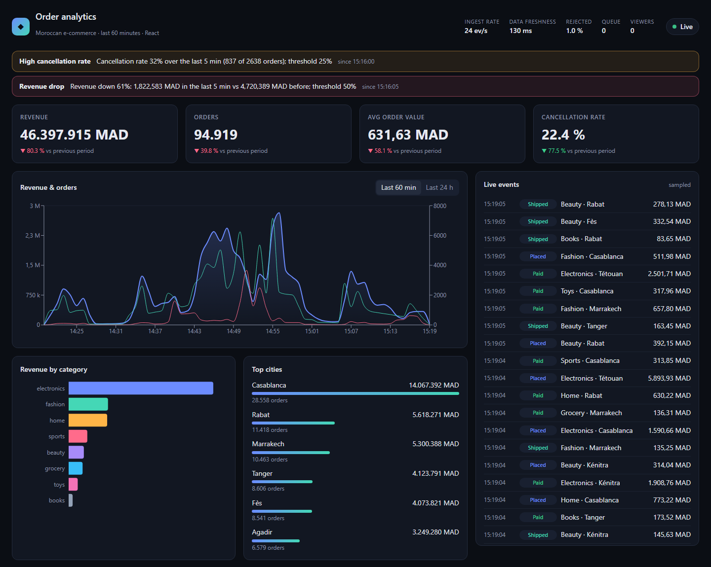
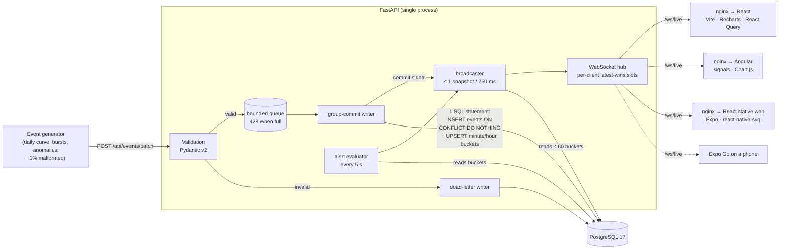
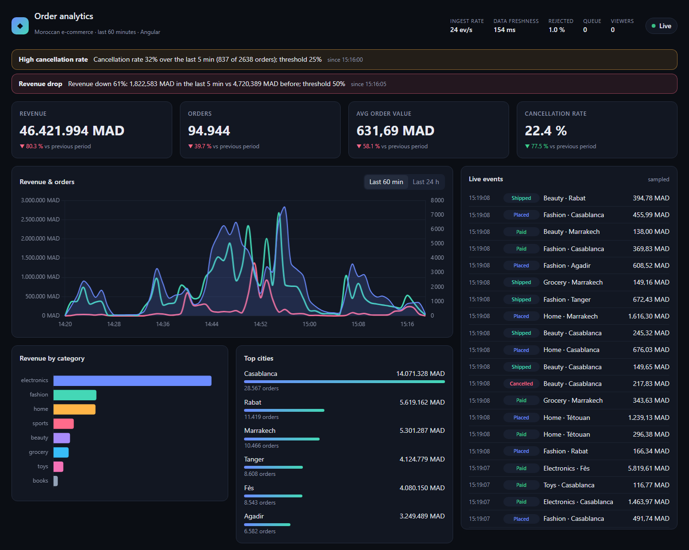
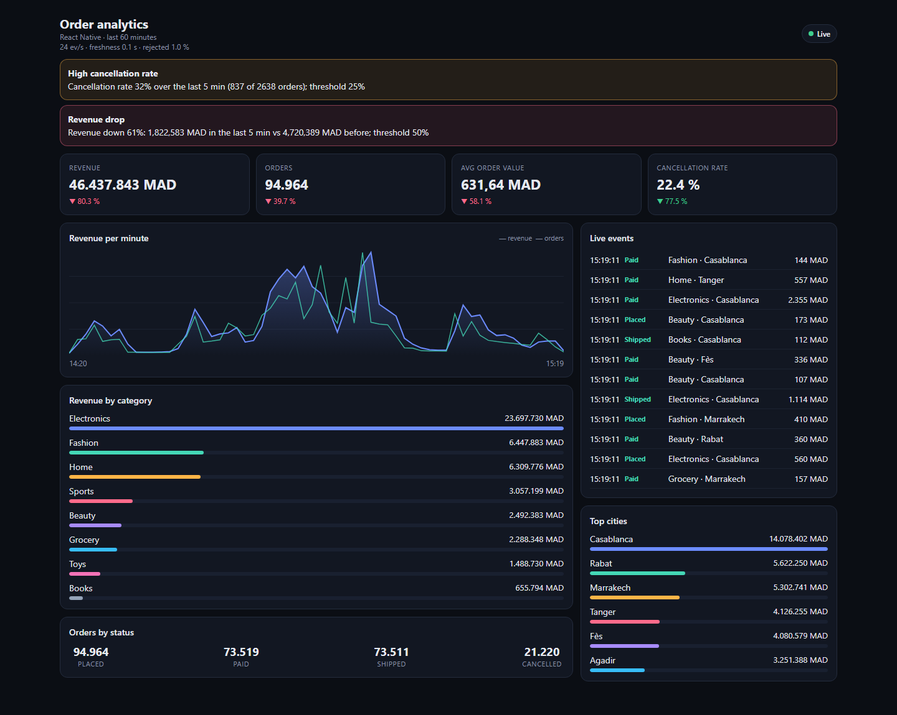

# realtime-analytics-dashboard

[](https://github.com/Israe236/realtime-analytics-dashboard/actions/workflows/ci.yml)

A real-time analytics pipeline for e-commerce orders — synthetic event stream → validated
ingestion → incremental aggregates in PostgreSQL → WebSocket push → live dashboards built
three ways: **React**, **Angular** and **React Native**.



## The problem

An online shop wants to see what is happening *now*: revenue per minute, orders, average
order value, cancellation rate, best categories and cities — and be warned the moment
something goes wrong (a spike in cancellations, a sudden revenue drop, a buggy client
sending garbage, or ingestion stopping altogether).

Doing that naively — re-running `SELECT sum(...) FROM orders WHERE created_at > now() - 1h`
for every viewer every second — gets slower as traffic grows and multiplies with every open
dashboard. This project shows a design whose read cost stays flat with both traffic and the
number of viewers, and explains every choice in [docs/DECISIONS.md](docs/DECISIONS.md).

Domain: order events (`order_placed`, `order_paid`, `order_shipped`, `order_cancelled`) with
amounts in Moroccan dirhams (MAD), product categories, Moroccan cities and payment methods.

## Architecture



Key ideas (each explained in plain language in [DECISIONS.md](docs/DECISIONS.md)):

- **Incremental, time-bucketed aggregates.** Each batch is inserted *and* added to per-minute
  and per-hour buckets in one atomic SQL statement; only rows that were really inserted count,
  so retried/duplicate events never double-count. Dashboards read at most 60 small buckets.
- **Group commit + backpressure.** One writer drains a bounded queue; batches grow with load;
  a full queue answers `429` instead of eating memory. `202` means "committed".
- **Dead letters, never crashes.** Every invalid event, unparseable body and even rows the
  database rejects are stored with the reason.
- **Push, throttled and conflated.** Snapshots are built once and shared by all clients; a slow
  client only ever holds the *latest* snapshot, and is disconnected if it falls hopelessly behind.
- **One contract for three frontends.** TypeScript types are generated from the backend's
  Pydantic models; a framework-free reconnecting client (exponential backoff + jitter,
  heartbeat timeout) is shared by all three apps.

## Quick start

Requirements: Docker with Compose v2.

```bash
docker compose up --build
```

| What | URL |
|---|---|
| React dashboard | http://localhost:3000 |
| Angular dashboard | http://localhost:3001 |
| React Native dashboard (web build) | http://localhost:3002 |
| API docs (OpenAPI) | http://localhost:8080/docs |

The generator starts sending ~50 events/s once the API is healthy; anomalies appear every
~7 minutes, so alerts show up after a few minutes. Ports and rates are configurable, see
[.env.example](.env.example) (`API_PORT`, `REACT_PORT`, `GEN_EVENTS_PER_SECOND`, …).

**React Native on a phone:** with the stack running, `cd frontends/mobile-react-native`,
`npm install`, then `EXPO_PUBLIC_API_URL=http://<your-computer-LAN-IP>:8080 npx expo start`
and scan the QR code with Expo Go.

## Screenshots

Captured from the running Docker stack (headless Edge) on 2026-09-14, all three a few seconds
apart and showing the same live data. The two banners are real alerts computed from the
generator's traffic (cancellation rate 32 %, revenue down 61 % versus the previous five
minutes). One honest caveat: the "vs previous period" arrows on the KPI cards are distorted,
because the previous hour contained the benchmark run's synthetic traffic (see "Measured
performance" below).

| React | Angular | React Native (web) |
|---|---|---|
|  |  |  |

## Measured performance

Measured on 2026-09-14 with [bench/src/bench/load_test.py](bench/src/bench/load_test.py);
raw results in [bench/results/](bench/results/).

| Offered load | Accepted events/s | Ingest ack latency p50 / p95 / p99 | Event created → dashboard snapshot received p50 / p95 / p99 |
|---|---|---|---|
| 500 events/s | **498.3** | 90 / 156 / 227 ms | **201** / 322 / 357 ms |
| 2,000 events/s | **1,984.0** | 73 / 169 / 312 ms | **193** / 328 / 430 ms |
| unlimited (8 connections × 500-event batches) | **7,901.9** | 403 / 1,178 / 2,035 ms | 544 / 1,286 / 2,139 ms |

No `429`s or errors in any run, and every batch appeared in a WebSocket snapshot.

End-to-end latency is measured precisely: each `202` response returns
`committed_through_seq`, and the benchmark's WebSocket client records when the first snapshot
with `through_seq ≥` that value arrives. About half of the ~0.2 s median is the deliberate
250 ms snapshot throttle.

**Conditions:** Intel Core i7-13620H laptop, Windows 11 + Docker Desktop (WSL2, 8 vCPUs);
single uvicorn process; generator and dashboards stopped; the load client ran on the same
machine, and another unrelated Compose stack was running. The limiting factor of the unlimited
run was not isolated (the Python client may be part of it). Read these as what this laptop
did, not as a capacity guarantee — details in DECISIONS §12.

Reproduce:

```bash
docker compose up -d --build postgres api
uv sync
uv run python -m bench --duration 60 --rate 2000 --batch-size 200 --concurrency 4
```

The benchmark writes real events (with a uniform, unrealistic mix of statuses) into the same
database the dashboards read, so for about an hour afterwards the dashboards show inflated
revenue and a very high cancellation rate, and the `cancellation_rate` alert fires. Run it
against a throwaway stack (`docker compose -p rtad-bench up -d postgres api` with other ports)
if you want to keep the demo data clean.

## Alerting rules

| Rule | Fires when | Resolves when | Minimum data | Severity |
|---|---|---|---|---|
| `cancellation_rate` | cancelled / placed ≥ 25 % (last 5 min) | < 20 % | 30 orders | warning |
| `revenue_drop` | last 5 complete minutes ≥ 50 % below the previous 5 | drop < 40 % | 2,000 MAD baseline | critical |
| `dead_letter_rate` | rejected / received ≥ 5 % (last 5 min) | < 4 % | 100 events | warning |
| `ingestion_stalled` | nothing committed for ≥ 30 s | < 30 s | one event since start | critical |

A condition must hold for 2 consecutive evaluations (every 5 s) to fire or resolve. Alerts are
stored (at most one open per rule, enforced by a partial unique index), pushed over the
WebSocket, included in each new client's `hello`, and listed at `GET /api/alerts`. Thresholds
are configurable with `APP_ALERT_*` environment variables.

## API

| Method | Path | Behaviour |
|---|---|---|
| `POST` | `/api/events/batch` | JSON array; each event validated separately. `202` after commit with `{accepted, rejected, errors[], committed_through_seq}`. `400` unparseable body, `413` too large, `429` writer saturated (`Retry-After`), `503` commit timeout. |
| `POST` | `/api/events` | Single event; `422` with error details if invalid. |
| `GET` | `/api/metrics/snapshot` | Latest metrics snapshot (same JSON as the WebSocket message). |
| `GET` | `/api/alerts?limit=50` | Alert history, newest first. |
| `GET` | `/api/health` | Database reachability and writer counters. |
| `WS` | `/ws/live` | `hello` (open alerts, recent events) → `snapshot` (≤ 4/s), `events` (sampled feed), `alert`, `ping` (every 15 s). |

## Tests and CI

| Suite | Count | What it covers |
|---|---|---|
| Backend + generator (pytest, real PostgreSQL) | 126 | validation edge cases; aggregates equal a full recompute after random batches with duplicates and late events; group commit, backpressure, retry and poison-row isolation; API behaviour for mixed/malformed/oversized/saturated requests; metric snapshots; hub slow-client handling; alert rules and evaluator; daily partitions and data retention; **WebSocket integration tests** against a real uvicorn server (two clients, abrupt disconnect, capacity limit, alert push); generator contract tests |
| Shared TypeScript (vitest) | 14 | reconnect/backoff, heartbeat timeout, message handling, formatting, chart paths |
| React (vitest + Testing Library) | 7 | WebSocket messages → React Query cache, connection badge countdown, KPI deltas (a rising cancellation rate is shown as bad) |
| Angular (vitest) | 7 | live service (hello, alert lifecycle, stable slices); components: connection badge, KPI deltas, alert banner, live feed row tracking |

[CI](.github/workflows/ci.yml) (GitHub Actions) runs on every push: ruff, `mypy --strict`,
pytest with a PostgreSQL service container, a check that the generated TypeScript protocol
matches the Pydantic models, lint/type-check/test/build for every frontend, and
`docker compose build`.
**Status:** passing — all six jobs (Python, four frontends, compose build) succeeded on
2026-09-14 (see the badge above for the latest run).

## Repository layout

```
backend/                 FastAPI app: ingestion, aggregation, metrics, WebSocket, alerting
generator/               synthetic order event producer
bench/                   load + end-to-end latency benchmark, results/
frontends/shared/        generated protocol types, LiveClient, helpers, shared CSS
frontends/web-react/     React + Vite + Recharts + React Query
frontends/web-angular/   Angular (standalone, zoneless, signals) + Chart.js
frontends/mobile-react-native/  Expo + react-native-svg (+ web export)
scripts/gen_ts_types.py  Pydantic → TypeScript codegen
docs/DECISIONS.md        design decisions in plain language
```

## Local development

```bash
docker compose up -d postgres                       # Postgres on localhost:55432
uv sync                                             # Python 3.13 workspace
uv run pytest                                       # backend + generator tests
uv run uvicorn --factory analytics_api.main:create_app --port 8080 --reload
GEN_EVENTS_PER_SECOND=100 uv run python -m event_generator
uv run python scripts/gen_ts_types.py               # after changing WebSocket models

cd frontends/web-react && npm install && npm run dev          # http://localhost:5173
cd frontends/web-angular && npm install && npx ng serve       # http://localhost:4200
cd frontends/mobile-react-native && npm install && npx expo start
```

The dev servers proxy `/api` and `/ws` to `localhost:8080`.

## Limitations

- **Single API process.** The writer queue is in memory: one process owns ingestion, and
  queued-but-uncommitted events are lost if it is killed (those requests never got a `202`, so
  a well-behaved producer resends them). Scaling out needs a shared queue or per-process
  writers.
- **No authentication or rate limiting per producer**, no TLS termination.
- **Deduplication key includes the timestamp.** `events` is partitioned by day, so its primary
  key is `(event_id, occurred_at)`: retries of the same payload are ignored, but the same
  `event_id` sent again with a *different* timestamp would be stored twice.
- **Static alert thresholds**; no seasonality-aware baselines.
- **Minute resolution**; only counts and sums are aggregated (no exact percentiles).
- **Every snapshot re-sends the 60-minute window** (a few KB) instead of deltas — simple and
  self-healing, but more bytes per client.
- **The React Native app has no automated UI tests**; it was verified by type-checking, a web
  export, and running it on a physical phone through Expo Go against the live stack.
- **Benchmark caveats**: one laptop, client on the same machine, bottleneck at the top rate not
  isolated.

## Next steps

- A small unpartitioned `event_ids` table if producers may resend an id with a changed timestamp.
- Horizontal scaling: several API processes, with PostgreSQL `LISTEN/NOTIFY` (or a real broker)
  to fan out commit signals, and per-dimension WebSocket subscriptions.
- Send snapshot deltas with sequence numbers and resync on gaps.
- Authentication for producers and dashboards.
- Run the benchmark with the load client on a separate machine and profile the API at its limit.
- Component tests for the React Native app; a production build (EAS) instead of Expo Go.
